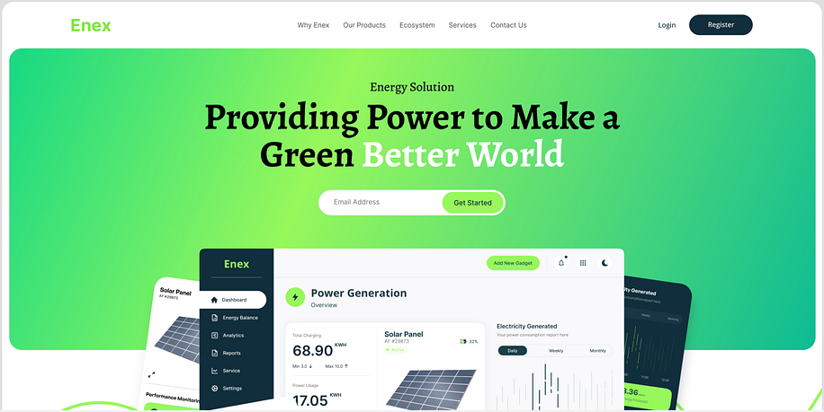

# Solar Panel Planner

## Table of Contents

* [Overview](#overview)
* [General Instructions](#general-instructions)
* [Requirements & Specifications](#requirements-specifications)
* [Acknowledgements](#acknowledgements)
* [Voyage Tasks](#voyage-tasks)
* [Team Documents](#team-documents)
* [Our Team](#our-team)

## Overview

Welcome, Chingus!

The city of Los Angeles is encouraging residents to install private solar panels as part of a local initiative to combat global warming. This project provides a free service where a city-hired specialist evaluates the installation and maintenance costs of solar panels. The initial MVP is a web-based application enabling residents to schedule appointments and allowing city employees to manage and plan these visits effectively.

In this voyage, your team will create a user-friendly solar panel planning application that simplifies the process of scheduling evaluations. Get ready to combine your problem-solving skills and creativity to build a tool that makes solar panel installation and maintenance planning a breeze!

The application supports two main roles:

**Resident:** Can request an appointment for a solar panel evaluation by submitting their contact details, address, and preferred timeslot.

**City Hall Employee:** Can access appointment requests, generate visit schedules for specialists, and export planning details in a downloadable/printable format.

## General Instructions

This project is designed to be worked on by a team rather than an individual
Chingu. This means you and your team will need to thoroughly read and
understand the requirements and specifications below, **_and_** define and
manage your project following the _Agile Methodology_ defined in the
[Voyage Handbook](https://github.com/chingu-voyages/Handbook/blob/main/docs/guides/voyage/voyage.md#voyage-guide).

As you create this project make sure it meets all of the requirements, but once
it reaches MVP, start implementing the optional features or get creative and
extend it in ways we haven't envisioned. In other words, use the power of
teamwork to make it distinctive and unique.

Take note that we haven't given specific direction on what your UI/UX should
look like. This is another area where you and your team can put your creativity 
to work! 

## Requirements & Specifications

### What You Need to Do

The following define the minimum requirements and ideas for features you may
implement to enhance this app, if time permits.

#### Structure

- [ ] This is a full-stack application. Frontend and backend are required.
- [ ] You may use any languages, tools, or libraries you prefer when designing and building this app.
- [ ] You may **_NOT_** use AI-based solution generators like GitHub Copilot.
- [ ] Useful links and resources:
  - [Los Angeles Addresses](https://catalog.data.gov/dataset/addresses-in-the-city-of-los-angeles/resource/cfcd5dce-b96c-43e8-bd36-aac11d14bf7d)
  - [IndexedDB](https://developer.mozilla.org/en-US/docs/Web/API/IndexedDB_API)
  - [Google Maps API](https://developers.google.com/maps/documentation/routes/overview#how_to_use_the_routes_api)
  - [Ethereal Email](https://ethereal.email)
  - [Github Authentication](https://www.npmjs.com/package/oauth-client-github)
  - [Google Authentication](https://developers.google.com/identity/gsi/web/guides/get-google-api-clientid) A detailed guide on how to obtain an API key and perform Google Authentication.

#### Styling

- [ ] Surprise us!!! Use your team's creativity to make this app distinctive.
- [ ] Add a footer containing a link to your team's GitHub repo.
- [ ] In general, you will find these [UI design principles](https://www.justinmind.com/ui-design/principles) helpful.
- [ ] Recommend using this resource for [clean CSS](https://israelmitolu.hashnode.dev/writing-cleaner-css-using-bem-methodology).

#### Functionality
- Overview

  - [ ] Develop a Fullstack application for solar panel application.

- Resident Interface

  - [x] Allow residents to submit a request for a solar panel evaluation by completing a web form with:
    - Name
    - Email
    - Phone Number
    - Address (validated against a provided dataset of Los Angeles addresses)
      - Address input supports autocomplete with suggestions based on a partial match against the [Los Angeles dataset](https://catalog.data.gov/dataset/addresses-in-the-city-of-los-angeles/resource/), ensuring correct and existing addresses are used.
    - Preferred timeslot
  - [ ] Allow residents to cancel the form 
  - [x] Notify residents that their preferred timeslot is only indicative and that they will receive confirmation a few hours before the scheduled visit.
  - [x] Implement request status tracking (e.g., pending, visited).
  - [ ] Allow residents to cancel an appointment at anytime.

- Admin Interface

  - [x] Implement a login system accessible through the `/admin` URL.
  - [x] Authenticate city hall employees via Google or GitHub OAuth securely.
  - [ ] Permit only pre-approved emails (e.g., verified city hall employees with the role of `planner` or `admin`) to log in.
  - [ ] Admins should be able to view a list of all resident requests with pagination controls. Each paginated view should display relevant request details, including the request's status, timeslot, and contact information.
  - [ ] Implement a search functionality to allow for quick retrieval of specific resident requests based on teams criteria.
  - [ ] Admins should have access to resident requests in different views (map and list), each displaying the sequential order of visits.
  - [ ] Provide an option to export the planned visits (regardless of the type of view selected) in a downloadable format (PDF, Excel, etc.) and which will always include details such as visit time slot, resident’s contact information, and address.
  - [x] Implement a "Mark as visited" functionality, to signify that a resident has been visited.

  - Algorithmic Planning

    - [ ] Develop a scheduling algorithm that optimizes visit order. This algorithm can be implemented in 2 ways (choose one or a combination of both)
    - [ ] The algorithm can be implemented either by using your own logic rules: using an average time for traffic, using the proximity of an address to another one, always starting with the furthest address, etc
    - [ ] The algorithm can be implemented either by using an external API like Google Routes API or Google Maps API, for calculating distances between 2 addresses for example.
    - [ ] The algorithm can be implemented by using a combination of your own logical rules and an external API 
    - [ ] Prioritize efficiency, aiming to minimize travel time between consecutive visits.
    - [ ] Example Simple Algorithm: For adjacent addresses, order them by street name and house number for consecutive visits and attempt to respect the preffered timeslot selected by the resident.
    - [ ] The planning algorithm should be handled and implemented in the backend.

- Data Management

  - [ ] Use a database of your choice to store resident requests.
  - [ ] Implement data validation to ensure addresses match the provided dataset from [Los Angeles Addresses](https://catalog.data.gov/dataset/addresses-in-the-city-of-los-angeles/resource/cfcd5dce-b96c-43e8-bd36-aac11d14bf7d).

- User Interface and Experience

  - [ ] Use responsive design techniques to ensure the application displays consistently across devices (desktop, tablet, mobile) without layout issues. Form fields and submission buttons are easy to interact with across all device sizes.

- Notifications

  - [ ] Implement a mail SMTP to notify residents by email at the end of the day before the visit, of the timeslot which has been assigned to them.
  - [ ] Use a mailer mocking tool like Ethereal to simulate sending the email and return a preview link to this mock email.

### Extras (Not Required)
- Admin Interface
  - [ ] Implement multiple authentication system for city hall employees (e.g., Google and GitHub).

## Acceptance Criteria

- Resident Interface

  - [ ] Users can submit requests with valid addresses, personal details, and timeslots.
  - [ ] Preferred timeslots are submitted but are not guaranteed.
  - [ ] Requests persist across sessions in a database of your choice.

- Admin Interface

  - [ ] Admins can view all resident requests.
  - [ ] Admins can generate an optimized visit schedule in a map format where each point on the map corresponds to an address and has a sequence associated with it which indicates the order in which the addresses should be visited. 
  - [ ] Admins can generate an optimized visit schedule in a list format in the order in which addresses should be visited 
  - [ ] Admins can export any of these views, and each export should also contain the details of each resident like name, contact details and actual address 
  - [ ] The login restricts access to approved city hall employee emails only.

- Scheduling Algorithm

  - [ ] Planning considers the efficiency of visit order based on address and time constraints.
  - [ ] Schedule export format includes time slot, address, and contact information for each appointment.

## Acknowledgements

## voyage-tasks

Your project's `readme` is as important to success as your code. For 
this reason you should put as much care into its creation and maintenance
as you would any other component of the application.

If you are unsure of what should go into the `readme` let this article,
written by an experienced Chingu, be your starting point - 
[Keys to a well written README](https://tinyurl.com/yk3wubft).

And before we go there's "one more thing"! Once you decide what to include
in your `readme` feel free to replace the text we've provided here.

> Own it & Make it your Own!

## Team Documents

You may find these helpful as you work together to organize your project.

- [Team Project Ideas](./docs/team_project_ideas.md)
- [Team Decision Log](./docs/team_decision_log.md)

Meeting Agenda templates (located in the `/docs` directory in this repo):

- Meeting - Voyage Kickoff --> ./docs/meeting-voyage_kickoff.docx
- Meeting - App Vision & Feature Planning --> ./docs/meeting-vision_and_feature_planning.docx
- Meeting - Sprint Retrospective, Review, and Planning --> ./docs/meeting-sprint_retrospective_review_and_planning.docx
- Meeting - Sprint Open Topic Session --> ./docs/meeting-sprint_open_topic_session.docx

## Our Team

Everyone on your team should add their name along with a link to their GitHub
& optionally their LinkedIn profiles below. Do this in Sprint #1 to validate
your repo access and to practice PR'ing with your team *before* you start
coding!

- Stanley Thijssen: [GitHub](https://github.com/inovux)
- Gerwyn: [GitHub](https://github.com/Gerwyn1)
- Raja: [Github](https://github.com/jeisaRaja)
- Patrick Macabulos [Github](https://github.com/psmacabulos) / [LinkedIn](https://www.linkedin.com/in/patrick-macabulos-developer)
- HL: [GitHub](https://github.com/hua-lun)
