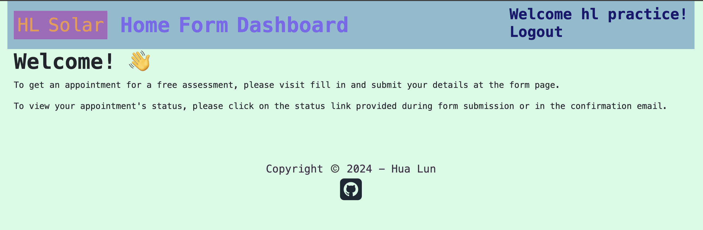

# Solar Panel Planner

Link to Web App: https://hlpractice.pythonanywhere.com/

## Table of Contents

* [Overview](#overview)
* [Specifications](#specifications)
* [Setup Instructions & Requirements](#setup-intructions--requirements)
* [APIs & Resources](#apis--resources)
* [Our Team](#our-team)

## Overview


`HL Solar` is a web application for requesting solar panel evaluations with admin dashboard interface.

## Specifications

### Residents
- `/form` 
  - Submit a request for solar panel evaluation with the following fields: Name, Email, Phone Number, Address and Preferred timeslot
- `/status/<requestId>` - Request Status
  - After form submission, residents are provided with a confirmation status link
  - View request status or Cancel Appointment
- Confirmation Timeslot
  - Email sent with timeslot information to residents, at around midnight of the day of appointment 
  - Python script with `pythonanywhere` scheduled task to automate email sending process
  
### Admins
- `/login`
  - Admins can log in with either GitHub or Google Accounts
    - Authorisation with [Security Rules](https://firebase.google.com/docs/rules/rules-and-auth)
- `/dashboard` - protected page
  - Algorithmic Planning (with RouteXL API)
    - Generated at the start of each working day
  - List View (with datatables)
    - Relevant information displayed into respective columns 
    - Table format with paginated controls, search functionality
    - View all created listings or today's listings
    - Button to update status to `Mark as Visited`
    - Button to print table as a `.pdf`
  - Map View (with leaflet.js)
    - Numbered Markers to indicate sequence
    - Button to print map

- GitHub and Google Authentication with `firebase`
- Form Address Autocomplete with `Geoapify`

### Data Management
Firebase's Cloud Firestore 


## Setup Intructions & Requirements

- `Python>=3.11` - Flask App
- `github OAuth App` - For GitHub Based Authentication
- `firebase account` - Authentication and Database
- `pythonanywhere account` - Deployment to Cloud
- `RouteXL account` - Route Optimisation API
- `Geoapify account` - Autocomplete Address API

> Create and store secrets in `.env` file
> Refactor URL links and other information, as accordingly

1. Clone Repo
```bash
git clone https://github.com/chingu-voyages/v52-tier3-team-30.git
```

2. Create Virtual Environment
```bash
python -m venv venv
```

3. Install Python Libraries
```bash
pip install -r requirements.txt 
```

4. Setup Firebase Project

> Reference: https://www.youtube.com/watch?v=HoRutj1z3fQ
- Add a Web App
  - Copy & Paste Config into `firebase_config.py` and `firebase-config.js`
- Generate Private Key
  - Project Settings
  - Generate (Save `.json` as `firebase-auth.json`)
- Authentication (Enable for Both Google and GitHub Logins)
- Cloud Firestore
  - **Schema**
    - appointments (Collection)
      - Date in format: YYYY-MM-DD (Document)
        - isCreated = False (Field)
    - residents (Collection)
      - (Document ID is Autogenerated)
        - Field: 
          - address (type: geopoint)
          - email (type: string)
          - name (type: string)
          - phone (type: string)
          - queue (type: string)
          - status (type: string)
          - timeslot (type: timestamp)

5. Change URL 
- `autocomplete.js`, change to your own domain
- `database.py`, line 15 - change to your own user agent

6. Run Flask App and visit link
```bash
python app.py 
```

7. Deploy to PythonAnywhere [Optional]


## APIs & Resources
- [DataTables](https://datatables.net/)
- Firebase
- Geoapify Autocomplete
- leaflet.js
- [Leaflet Browser Print](https://github.com/Igor-Vladyka/leaflet.browser.print)
- [Mock Email Sending with SMTP Bucket](https://www.smtpbucket.com/emails?sender=admin@hlsolar.email)

## Our Team

Everyone on your team should add their name along with a link to their GitHub
& optionally their LinkedIn profiles below. Do this in Sprint #1 to validate
your repo access and to practice PR'ing with your team *before* you start
coding!

- Gerwyn: [GitHub](https://github.com/Gerwyn1)
- HL: [GitHub](https://github.com/hua-lun)
  - Fullstack Development
  - Database Management
  - Cloud Deployment
